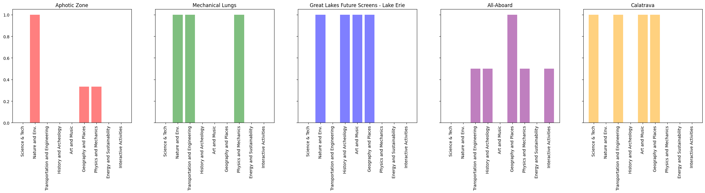

# Hacksgiving 2024

## Running the frontend

The frontend uses Bun. To install dependencies run the following commands:

```bash
cd frontend
bun install
```

To run the frontend in dev mode run:

```bash
bun run dev
```

## Running the backend

Install UV as a package Manager
Update the API Keys and tokens with ones that are working for Gemini, LiveKit and OpenAI.
```bash
cd backend/src
uv run main.py --rewrite
```
and in another terminal
```bash
cd backend/src
uv run livekit-serve.py
```

## Team Members
 - Alhagie Boye (Head Translator)
 - Olek Drobek (RAG Thought Leader)
 - Sonia Grade
 - Caleb Gray (The Beast)
 - Autumn Mizer (Head UX Designer)
 - Alex Neher (DB Architect)
 - Bart Gebka


# Theory

## Exhibit Recommendation Engine (XRE)

The Exhibit Recommendation Engine (XRE) is a system that recommends exhibits to users based on their interestes, exhibit popularity, and their past exhibits.

### Preprocessing Exhibits into meta topics

Each exhibit came with a list of topics, however this list was too large to be used directly in the recommendation engine. To reduce the dimensionality of the topics, we used a pre-trained embedding model to embed the topics and preset meta topics, which were then used to cluster the topics into meta topics. The meta topics were then used to represent the exhibits.

#### Metatopics used

Chat GPT analyzed all topics and created the following metatopics:

- Science and Technology
- Nature and Environment
- Transportation and Engineering
- History and Archaeology
- Art and Music
- Geography and Places
- Physics and Mechanics
- Energy and Sustainability
- Interactive Activities

#### Example clustering

The following topics were clustered into the following metatopics:

```
🔬 Science and Technology:           lasers, invention, telegraph
🌿 Nature and Environment:           weather, microorganisms, fish
🚗 Transportation and Engineering:   planes, cars, shipping
🏺 History and Archaeology:          archaeology, mummy, dinosaurs
🎨 Art and Music:                    electric-guitar, harmonica, Gibson
🌍 Geography and Places:             Wisconsin, Milwaukee, Great Lakes
⚙️ Physics and Mechanics:            physics, aerodynamics, force
🌱 Energy and Sustainability:        generator, energy transfer, energy
🎮 Interactive Activities:           collaboration, board games, game show
```

### Exhibit Embeddings

Using the meta topics, we create a nine dimensional vector for each exhibit (where each dimension corresponds to a meta topic). This vector is used to represent the exhibit in the recommendation engine. The embeddings are created by adding 1 to the corresponding dimension for each topic that belongs to the meta topic and finally dividing by the max value in the vector (not L2 normalization).

Visualization of exhibit embeddings:



### User Embeddings

Before the user can receive recommendations, they must first provide their interests. The user selects how interested they are in each of the meta topics. The user's interests are then used to create a user embedding, which is a nine dimensional vector where each dimension corresponds to a meta topic.

These embeddings are then used to calculate the similarity between the user and the exhibits.

### Popularity

The popularity of the exhibit is an important factor when considering recommendations. The popularity of each exhibit is provided by the museum and is used to rank the exhibits. In general we prefer to recommend popular exhibits over less popular ones.

### User History

The user's history is also an important factor when considering recommendations. The user's history is a list of exhibits that the user has visited in the past. The user's history is used to filter out exhibits that the user has already visited.

### Combining Recommendation Factors

Each of the three factors (user interests, exhibit popularity, and user history) are combined to create a final score for each exhibit. The final score is used to rank the exhibits and provide the user with a list of recommended exhibits.


### Future work
- Update visitation logic to better track user history
- Use age to filter out exhibits that are not age appropriate
- Use location to recommend exhibits that are close to the user (done partially by features)
- Use time of day to recommend exhibits that are open
- Use an LLM to generate the final recommendations. 
